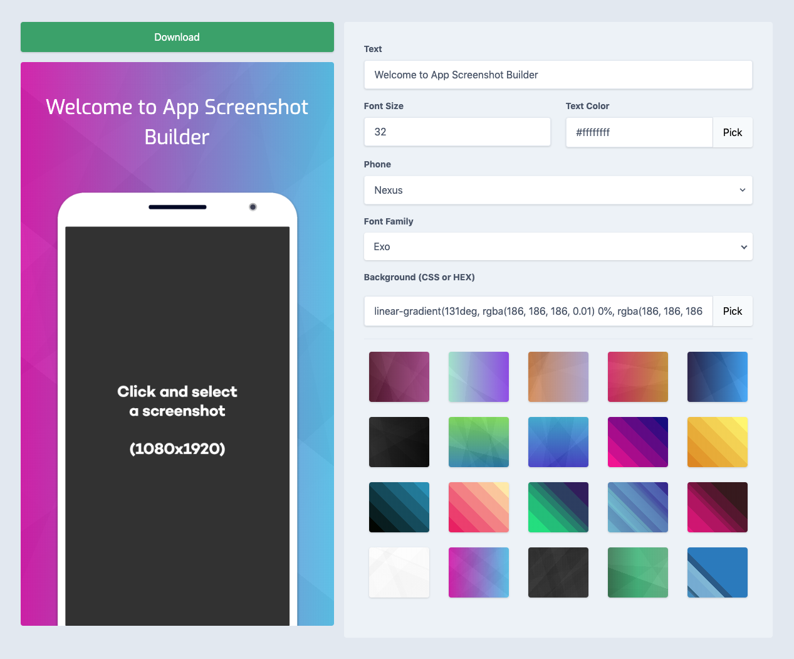

# App Screenshot Builder

It is now very easy to prepare your Play Store and App Store app presentation visuals!

- Choose Screenshot,
- Write the text,
- Select background and font and download

That is all :)

## Online Demo
[Click here!](https://app-screenshot-builder.netlify.com/)


## Preview



## Development
You can install and develop the application on your computer.

### Project setup
```
npm install
```

### Compiles and hot-reloads for development
```
npm run serve
```

### Compiles and minifies for production
```
npm run build
```

### Customize configuration
See [Configuration Reference](https://cli.vuejs.org/config/).
